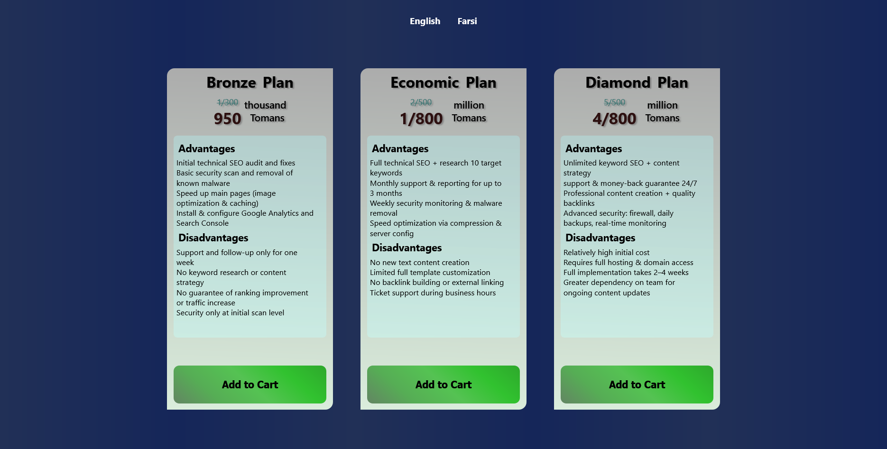

## FreeCodeCamp 2nd Certification Project

This is improved version of the second certification project in freecodecamp's Responsive Web Design Certification.

## Table of contents

- [Overview](#overview)
  - [Screenshot](#screenshot)
  - [Links](#links)
- [My process](#my-process)
  - [Built with](#built-with)
  - [What I learned](#what-i-learned)
  - [Continued development](#continued-development)
  - [Useful resources](#useful-resources)
  - [AI Collaboration](#ai-collaboration)
- [Author](#author)
- [Acknowledgments](#acknowledgments)

## Overview

### Screenshot

### Links

- Solution URL: [solution URL](https://github.com/arshiya-sr/Plan-cards-Project)
- Live Site URL: [live site URL](https://arshiya-sr.github.io/Plan-cards-Project/)

## My process

first i completed the html structure as much as needed then i went to css and styling it after that improvements to the semantic html and better and more accurate styling. then i added responsive animations, media queries and modified mobile UI and then i added langouge change between persian and english.

### Built with

- Semantic HTML5 markup
- Flexbox
- media queries

### What I learned

This project taught me so many things:
- working with flexbox more professionally.
- switching the page language without any JavaScript.
- using modern and attractive gradients.
- and designing a component that can be reused in larger projects.

### Continued development

I'll continue development working on:

- More responsive and responsible design and workflow.
- Using Relative units.
- Making this a bigger project or adding this into bigger ones.

### Useful resources

- (https://www.deepseek.com) - DeepSeek has helped me immensely on my learning journey—it's far better to use it for truly understanding concepts than for just getting answers and bypassing the work.
- (https://github.com/copilot) - GitHub Copilot has also been a huge help, especially when it comes to coding.
- (https://www.freecodecamp.org) - I gained my web development knowledge through freeCodeCamp, which is completely free and packed with resources: theory, labs, workshops, quizzes, and even review projects that help you master each topic. This project itself comes from freeCodeCamp, so a big thank-you to them.

### AI Collaboration

- What tools did you use (e.g., ChatGPT, Claude, GitHub Copilot)? i only used deepseek and github copilot AI
- How did you use them (e.g., debugging, generating boilerplate, brainstorming solutions)? i used it to help me understand the structure and debug small pieces of codes.

## Author

- github - (https://github.com/arshiya-sr)
- Frontend Mentor - (https://www.frontendmentor.io/profile/arshiya-sr)
- FreeCodeCamp - (https://www.freecodecamp.org/arshiya_sr)

## Acknowledgments

thank to Freecodecamp for this awesome Project/Challenge, and thank to you for paying your time and attention to my project. I'd be happy to receive your advice and recommendations.
Hope you a good day ♥
